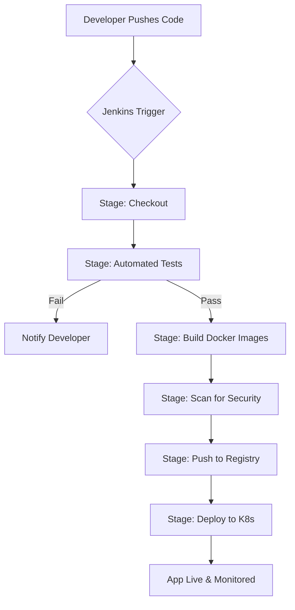

# Jenkins CI/CD Workflow for IMS Pro

This document outlines the automated pipeline for testing, building, and deploying the IMS Pro application using Jenkins.

---

## 🏗️ Pipeline Architecture

The Jenkins pipeline follows a **Declarative Pipeline** structure, ensuring a consistent and repeatable process for every code change.

## 🔄 Visual Workflow



---

## 👨‍💻 Developer Workflow

1.  **Code & Commit**: Developer works on a feature branch and commits changes.
2.  **Pull Request**: Developer opens a PR to `main`.
3.  **CI Trigger**: Jenkins automatically starts the "Build Check" pipeline.
4.  **Feedback Loop**: If tests fail, Jenkins marks the PR as failed. Developer fixes the code.
5.  **Merge**: Once tests pass and code is reviewed, the PR is merged.
6.  **CD Trigger**: Jenkins triggers the production deployment pipeline.
7.  **Rollout**: Kubernetes performs a rolling update to the latest version.

---

## 🏗️ Pipeline Architecture Detail

### 1. Stage: Checkout
*   Jenkins pulls the latest code from the `main` or feature branch.

### 2. Stage: Testing (Quality Gate)
*   **Backend**: Runs `pytest` to ensure all API endpoints are functioning correctly.
*   **Frontend**: Runs `npm test` to verify React components and logic.
*   *Note: If any test fails, the pipeline stops here.*

### 3. Stage: Build & Containerize
*   Uses `docker-compose build` or individual `docker build` commands.
*   Tags the images with the build number or git commit hash for traceability.

### 4. Stage: Security Scan (Optional)
*   Uses tools like **Trivy** to scan the built Docker images for known vulnerabilities.

### 5. Stage: Push to Registry
*   Logs into Docker Hub (or a private registry).
*   Pushes `ims-backend` and `ims-frontend` images.

### 6. Stage: Deploy to Kubernetes
*   Connects to the K8s cluster.
*   Runs `kubectl apply -f k8s/` to rollout the new version.
*   Performs a `kubectl rollout status` to ensure the deployment was successful.

---

## 📜 The Jenkinsfile (Preview)

Here is a conceptual example of the `Jenkinsfile` we will use:

```groovy
pipeline {
    agent any
    
    environment {
        DOCKER_HUB_USER = 'your-user'
        KUBECONFIG_ID = 'k8s-config'
    }

    stages {
        stage('Install Dependencies') {
            steps {
                sh 'cd backend && pip install -r requirements.txt'
                sh 'cd frontend && npm install'
            }
        }
        
        stage('Test') {
            steps {
                sh 'cd backend && pytest'
                sh 'cd frontend && npm test'
            }
        }

        stage('Build Images') {
            steps {
                script {
                    docker.build("${DOCKER_HUB_USER}/ims-backend:${env.BUILD_ID}", "./backend")
                    docker.build("${DOCKER_HUB_USER}/ims-frontend:${env.BUILD_ID}", "./frontend")
                }
            }
        }

        stage('Deploy') {
            steps {
                withKubeConfig([credentialsId: KUBECONFIG_ID]) {
                    sh 'kubectl apply -f k8s/'
                }
            }
        }
    }
}
```

---

## 🚀 How to Execute
1.  Ensure a Jenkins server is running with Docker and `kubectl` installed.
2.  Add your Docker Hub and Kubernetes credentials to the Jenkins Credentials Provider.
3.  Create a "Pipeline" job and point it to this repository.
